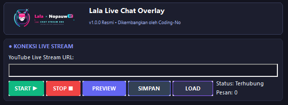
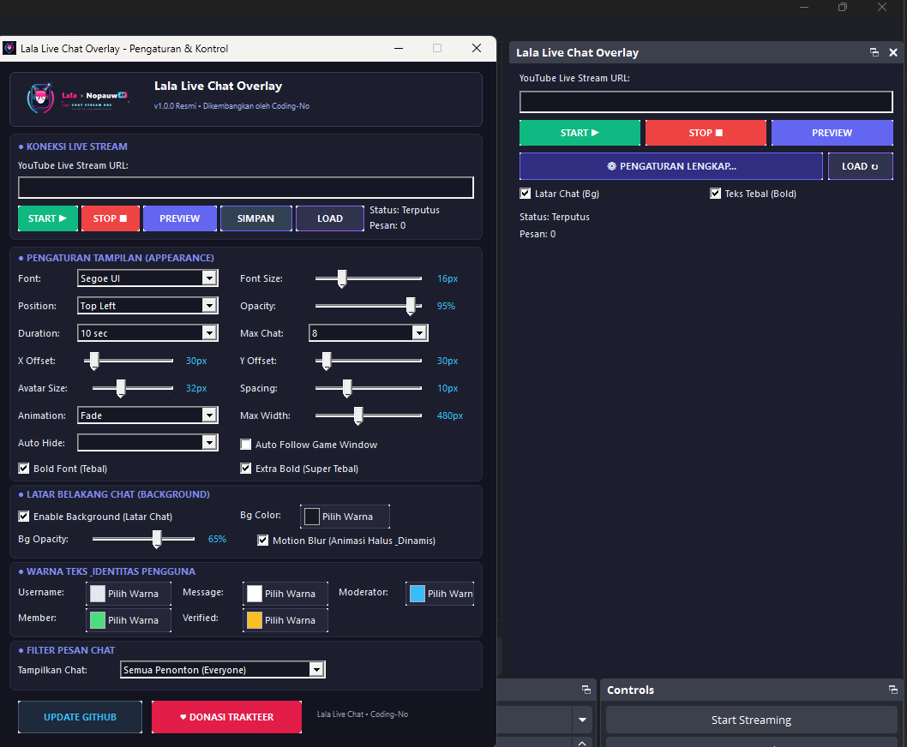
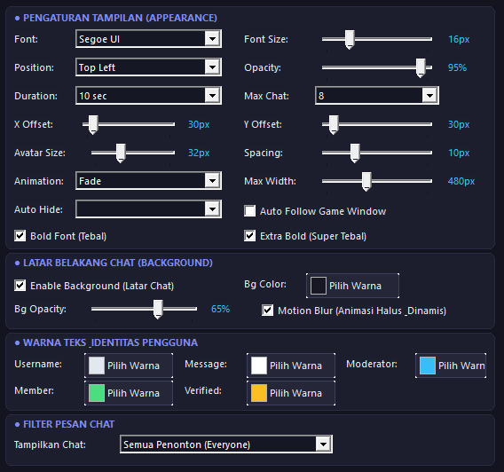
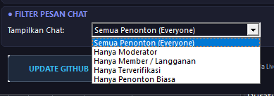
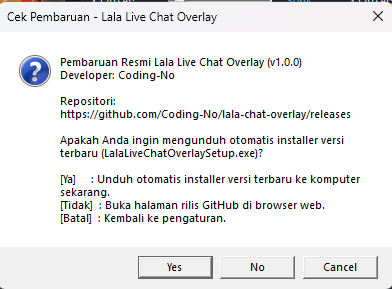

# Lala Live Chat Overlay — v1.0.0

Baca live chat YouTube langsung di atas game, tanpa alt-tab, tanpa API key Google, tanpa relay bot.

Dibikin buat streamer yang main game di **satu monitor** tapi tetep pengen liat chat. Chat-nya nempel di atas game — tapi **penonton stream lo nggak liat chat itu**, cuma lo yang liat.

Dibuat oleh **Coding-No** — Lala × Nopauw.

[-blue.svg)](#syarat-sistem)
[](#cara-pasang-di-obs)
[](https://github.com/Coding-No/lala-chat-overlay/releases)
[](https://trakteer.id/nopauwxp/gift)
[](LICENSE)

---

## Galeri

### 1. Koneksi Live Stream

Tempel URL live YouTube, pencet START. Status koneksi sama jumlah pesan keliatan langsung di situ.



### 2. Dock OBS + Panel Pengaturan Lengkap

Jalan sebagai dock di OBS Studio — kontrol cepat ada di dock, panel gede buat atur semua tampilan.



### 3. Pengaturan Tampilan

Font, ukuran, posisi, durasi, jumlah chat maksimal, offset X/Y, ukuran avatar, animasi, transparansi latar, warna tiap role penonton — semua bisa diatur sambil live.



### 4. Filter Pesan Chat

Cuma mau tampilin moderator? Atau cuma member? Bisa.

- Semua Penonton (Everyone)
- Hanya Moderator
- Hanya Member / Langganan
- Hanya Terverifikasi
- Hanya Penonton Biasa



### 5. Cek Pembaruan

Ada versi baru, tinggal unduh installer-nya langsung dari dalam aplikasi — nggak usah nyari manual ke GitHub.



---

## Kenapa bikin ini

Main game di satu monitor sambil live streaming itu nyiksa. Mau liat chat harus alt-tab — gameplay-nya kacau. Aplikasi overlay chat yang ada biasanya:
- nyolong fokus keyboard (lo mau gerak, malah ngetik di chat box),
- ketangkep di rekaman stream (penonton malah liat chat lo, bukan game lo),
- atau minta API key Google + relay bot pihak ketiga.

Lala Live Chat Overlay ngerjain tiga-tiganya sekaligus:

1. **Konek langsung.** Tempel URL live YouTube, langsung nyambung ke live chat YouTube. Nggak butuh Google API key, nggak butuh login OAuth, nggak butuh Streamlabs / StreamElements / Restream.
2. **Transparan beneran.** Chatnya ngambang di atas game borderless fullscreen. Nggak ada kotak latar, nggak ada layar yang diremangin.
3. **Nggak ganggu gameplay.** Pakai `WS_EX_TRANSPARENT` + `WS_EX_NOACTIVATE` — klik, scroll, tombol keyboard semuanya nembus ke game. Focus nggak pernah diambil.
4. **Nggak ketangkep di stream.** Pakai `WDA_EXCLUDEFROMCAPTURE` — **lo liat chat di layar lo, penonton cuma liat game.**

---

## Arsitektur

```
[URL YouTube Live]
        │
        ▼
[YouTubeChatProvider] ──── (Backoff Reconnect: 2s, 5s, 10s, 20s, 30s)
        │
        ├─► [ChatDiscovery]        (Ambil Video ID, API Key, token InnerTube)
        ├─► [ChatParser]           (Ambil batch live chat & continuation)
        ├─► [MessageParser]        (Bersihin input, format runs & Super Chat)
        └─► [UserMetadataParser]   (Avatar & role: Owner, Mod, Member, Verified)
        │
        ▼
[Antrian ChatMessage] ──────── (Dedup pakai messageId + Spam Guard)
        │
        ▼
[OverlayController] ──────── (DPI aware, ticker 60 FPS, auto-hide, layout)
        │
   ┌────┴────────────────────────┐
   ▼                             ▼
[WindowsOverlayWindow]      [ChatRenderer]
 - WS_EX_TOPMOST             - GDI+ antialias hardware
 - WS_EX_TRANSPARENT         - DIB Section 32-bit ARGB
 - WS_EX_NOACTIVATE          - Compositing avatar bulat
 - WDA_EXCLUDEFROMCAPTURE    - Badge role & shadow teks
```

### Lapisan abstraksi

Pipeline YouTube dipisah rapi jadi kelas-kelas sendiri:

- **`YouTubeChatProvider`** — ngatur thread, state machine (`Connecting`, `Connected`, `Reconnecting`, `Error`), cache avatar async.
- **`ChatDiscovery`** — nerima URL YouTube format apa aja (`watch?v=`, `youtu.be/`, `/live/`, `/shorts/`), ambil `INNERTUBE_API_KEY` + versi client, terus nembak endpoint InnerTube `next` buat dapetin `liveChatRenderer` yang aktif.
- **`ChatParser`** — ngobrol sama endpoint InnerTube `get_live_chat`, ngatur cursor continuation sama timeout polling.
- **`MessageParser`** — sanitasi input yang masuk (buang control code, encode HTML mentah, potong payload jahat, unicode/emoji tetep utuh).
- **`UserMetadataParser`** — nentuin role penonton (`Owner`, `Moderator`, `Member`, `Verified`, `Regular`) dan milih avatar resolusi paling gede.

---

## Matriks Metode Capture di OBS

| Metode Capture di OBS | Teknologinya | Lo Liat Chat? | Penonton Liat Chat? | Status & Penjelasan |
| :--- | :--- | :---: | :---: | :--- |
| **OBS Game Capture** | Hook grafis in-process (`graphics-hook.dll`) nangkep DirectX/Vulkan `Present` | **IYA** | **NGGAK (di-exclude)** | **Didukung.** Hook nangkep frame di dalam proses game sebelum DWM nyusun desktop. |
| **OBS Window Capture** | Win32 PrintWindow / WGC ke window game | **IYA** | **NGGAK (di-exclude)** | **Didukung.** Cuma nangkep HWND game; HWND overlay nggak ikut. |
| **OBS Display Capture (WGC)** | Windows Graphics Capture | **IYA** | **NGGAK (di-exclude)** | **Didukung.** DWM ngebuang window yang punya `WDA_EXCLUDEFROMCAPTURE`. |
| **OBS Display Capture (DXGI)** | DXGI Desktop Duplication API | **IYA** | **NGGAK (di-exclude)** | **Didukung.** Compositor hardware ngebuang permukaan window itu dari buffer capture. |
| **GDI BitBlt (jadul)** | Copy memori dari screen DC | **IYA** | Tergantung (kotak hitam) | Usang. Di Windows build lama, BitBlt bisa ngegambar kotak hitam di posisi window yang di-exclude. OBS 30+ defaultnya udah WGC/DXGI. |

### Borderless vs Exclusive Fullscreen

- **Borderless Fullscreen (disaranin):** game jalan sebagai window maksimal tanpa border. DWM yang nyusun, jadi overlay topmost kita bisa muncul di atas game — akselerasi hardware, klik nembus, capture ke-exclude. Mulus.
- **Exclusive Fullscreen (batasan OS):** di mode ini game nguasain adapter GPU langsung, ngelewatin komposisi DWM. Nggak ada aplikasi desktop luar yang bisa nggambar di atasnya tanpa nyuntik kode ke proses game — dan itu mancing ban anti-cheat (Easy Anti-Cheat, BattlEye, Vanguard). Plugin ini **nggak akan pernah crash** kalau mode fullscreen berubah — dia cuma ngasih tahu lo buat pilih **Borderless Fullscreen** di setelan game.

---

## Fitur

- **Nggak ada relay pihak ketiga.** Nol dependensi ke Streamlabs, StreamElements, Restream, atau server orang.
- **Nggak butuh Google API Key.** Konek langsung pakai protokol streaming publik — nggak usah bayar atau bikin project di Google Cloud Console.
- **Transparansi beneran.** Nggak ada kotak latar, nggak ada layar diremangin.
- **Shadow teks kontras tinggi.** Tetep kebaca, mau lo lagi main di dungeon gelap atau padang terang.
- **Avatar bulat.** Foto profil YouTube asli, fallback otomatis ke inisial berwarna sesuai role.
- **Badge role.** Badge ringkas buat **Owner**, **Moderator**, **Member**, dan **Verified**.
- **Durasi chat & fade halus.** Bisa diatur (3s, 5s, 10s, 15s, 30s, 60s, Never) dengan fade-out alpha yang mulus.
- **Batasan jumlah chat.** Batasi pesan yang tampil barengan (3, 5, 8, 10, 15, 20) biar layar nggak penuh.
- **Preview langsung.** Pencet **PREVIEW** di dialog pengaturan buat liat pesan dummy sambil ngatur posisi, ukuran, opacity, warna, dan margin secara real-time.
- **Auto-hide.** Overlay otomatis memudar kalau nggak ada chat selama X detik, muncul lagi begitu ada pesan baru.
- **Spam guard & rate limit.** Dedup pesan pakai ID, tahan banjir chat tanpa stutter atau bocor memori.
- **Auto-reconnect.** Backoff eksponensial kalau koneksi putus (2s, 5s, 10s, 20s, 30s).
- **Filter role.** Pilih mau nampilin chat dari Semua, Moderator, Member, atau Verified.
- **Cek pembaruan di dalam app.** Ada rilis baru, langsung bisa diunduh installer-nya atau buka halaman GitHub Releases.
- **Installer all-in-one.** Satu `.exe` yang auto-detect OBS Studio, sekaligus bisa masang versi standalone tanpa plugin.
- **Teks tebal & super tebal.** Buat lo yang main game rame dan butuh chat yang gampang kebaca.
- **Auto Follow Game Window.** Overlay bisa nempel ngikut window game yang lagi aktif.

---

## Struktur Proyek

```
youtube-chat-overlay/
├── CMakeLists.txt              # Build script CMake terpadu (Ninja / MSVC)
├── README.md                   # Dokumentasi & panduan lengkap
├── LICENSE                     # Lisensi MIT
├── main.cpp                    # Entrypoint aplikasi standalone (YouTubeChatOverlay.exe)
├── assets/
│   └── screenshots/            # Screenshot buat dokumentasi
├── models/
│   ├── ChatMessage.hpp         # ChatMessage, BadgeInfo, state rendering
│   ├── ChatConfig.hpp          # Setting, preset layout, persistensi JSON
│   └── UserRole.hpp            # Enum UserRole & helper
├── youtube/
│   ├── HttpClient.hpp/.cpp     # Klien WinHTTP native (TLS 1.3, nol lib pihak ketiga)
│   ├── ChatDiscovery.hpp/.cpp  # Validasi URL & discovery continuation InnerTube
│   ├── ChatParser.hpp/.cpp     # Fetcher batch chat & parser pagination
│   ├── MessageParser.hpp/.cpp  # Ekstraksi text run & sanitasi input
│   ├── UserMetadataParser.hpp/.cpp # Pemilihan URL avatar & parser badge role
│   └── YouTubeChatProvider.hpp/.cpp # Loop polling async & mesin reconnect
├── overlay/
│   ├── WindowsOverlayWindow.hpp/.cpp # Window Win32 layered, click-through, topmost
│   ├── ChatRenderer.hpp/.cpp   # Compositor GDI+ antialias dengan shadow teks
│   └── OverlayController.hpp/.cpp # Koordinator, antrian pesan, ticker animasi 60 FPS
├── ui/
│   └── SettingsDialog.hpp/.cpp # Dialog kontrol dark mode + preview langsung
├── obs-plugin/
│   ├── obs-module-compat.h     # Definisi ABI C OBS & versi semantik
│   └── plugin-main.cpp         # Entrypoint modul OBS & integrasi menu Tools
├── installer/
│   ├── installer_main.cpp      # Installer sekali klik (LalaLiveChatOverlaySetup.exe)
│   └── setup.iss               # Script kompilasi Inno Setup 6
├── tests/
│   ├── test_overlay_poc.cpp    # Fase 2: tes PoC layered click-through
│   ├── test_youtube_reader.cpp # Fase 3: tes reader streaming chat InnerTube
│   ├── test_chat_overlay.cpp   # Fase 4: tes integrasi chat live ke overlay
│   ├── test_preview.cpp        # Fase 7: tes preview langsung & parameter dinamis
│   ├── test_exclusion_dpi.cpp  # Fase 8: tes exclusion capture & multi-DPI/resolusi
│   └── test_stress.cpp         # Fase 10: tes banjir spam, keamanan, & stress
└── docs/
    └── RESEARCH_AND_ARCHITECTURE.md # Laporan riset teknis detail
```

---

## Cara Pasang

### Cara 1: Installer All-in-One (disaranin buat streamer)

1. Unduh **`LalaLiveChatOverlaySetup.exe`** dari halaman [Releases](https://github.com/Coding-No/lala-chat-overlay/releases).
2. Dobel klik installer-nya. Tampilannya dark UI modern dengan branding resmi.
3. Yang dia kerjain:
   - **Auto-detect OBS Studio:** nemu instalasi OBS standar maupun custom, ada dialog browse folder kalau OBS-nya di lokasi portable.
   - **Centang "Pasang Plugin OBS Studio":** plugin 64-bit otomatis dipasang ke OBS.
   - **Centang "Software Saja Tanpa Plugin OBS":** pasang aplikasi standalone (`LalaLiveChatOverlay.exe`) plus shortcut Desktop & Start Menu.
4. Buka OBS Studio. Masuk ke **Docks -> Lala Live Chat Overlay** atau **Tools -> Lala Live Chat Overlay**.

### Cara 2: Aplikasi Standalone

Kalau nggak mau pakai plugin OBS, langsung jalanin **`LalaLiveChatOverlay.exe`**. Dia jalan sendiri di samping game apapun dan software streaming apapun.

### Cara 3: Pasang Plugin Manual

Copy `yt-chat-overlay.dll` ke folder plugin OBS:

- **Global:** `C:\Program Files\obs-studio\obs-plugins\64bit\yt-chat-overlay.dll`
- **ProgramData:** `C:\ProgramData\obs-studio\plugins\yt-chat-overlay\bin\64bit\yt-chat-overlay.dll`
- **User:** `%APPDATA%\obs-studio\plugins\yt-chat-overlay\bin\64bit\yt-chat-overlay.dll`

Kalau pasang manual, **jangan** taruh di `obs-plugins\64bit\` kalau OBS lo versi portable — sesuaikan sama lokasi instalasi OBS lo.

---

## Cara Build dari Source

### Yang dibutuhin

- Windows 10/11 (64-bit)
- Visual Studio 2022 (MSVC v143 atau Build Tools)
- Windows 10/11 SDK (10.0.19041+)
- CMake 3.20+ dan Ninja

### Perintah build

```cmd
:: 1. Buka Visual Studio Developer Command Prompt (x64)
call "C:\Program Files (x86)\Microsoft Visual Studio\2022\BuildTools\VC\Auxiliary\Build\vcvars64.bat"

:: 2. Configure dan build pakai CMake + Ninja
cmake -B build -G Ninja -DCMAKE_BUILD_TYPE=Release
cmake --build build --config Release
```

Hasil build-nya:

- `build/LalaLiveChatOverlaySetup.exe` — installer all-in-one
- `build/LalaLiveChatOverlay.exe` — aplikasi desktop standalone
- `build/yt-chat-overlay.dll` — plugin native OBS Studio 64-bit
- `build/test_*.exe` — executable tes independen

---

## Test Suite

Tiap fase development punya executable verifikasi sendiri:

| Binary Tes | Yang Diverifikasi | Perintah |
| :--- | :--- | :--- |
| `test_overlay_poc.exe` | `WS_EX_TRANSPARENT`, `WS_EX_TOPMOST`, `WS_EX_NOACTIVATE`, click-through, nol pencurian fokus | `build\test_overlay_poc.exe` |
| `test_youtube_reader.exe` | Discovery API InnerTube, polling live chat, error handling, parsing avatar | `build\test_youtube_reader.exe [URL]` |
| `test_chat_overlay.exe` | Streaming chat real-time langsung ke overlay transparan desktop | `build\test_chat_overlay.exe [URL]` |
| `test_preview.exe` | Injeksi chat dummy & penyesuaian parameter live secara real-time | `build\test_preview.exe` |
| `test_exclusion_dpi.exe` | `WDA_EXCLUDEFROMCAPTURE`, DPI 100%/150%/200%, batas 1080p/1440p/4K | `build\test_exclusion_dpi.exe` |
| `test_stress.exe` | Sanitasi input (XSS/control code) & banjir spam 1.000 pesan bersamaan | `build\test_stress.exe` |

---

## Syarat Sistem

- **OS:** Windows 10 atau 11, 64-bit
- **GPU:** apa aja yang bisa jalanin game lo — overlay-nya pakai GDI+, nggak butuh GPU khusus
- **OBS Studio:** v29 sampai v32+ (opsional — versi standalone nggak butuh OBS)
- **Game:** wajib mode **Borderless Fullscreen** biar overlay kelihatan

---

## FAQ

**Chat-nya nggak muncul, kenapa?**
Cek dulu: game lo udah Borderless Fullscreen belum? Kalau masih Exclusive Fullscreen, nggak ada aplikasi luar yang bisa nggambar di atasnya. Ubah di setelan display game.

**Ini bakal kena ban anti-cheat nggak?**
Nggak. Overlay ini cuma aplikasi desktop biasa yang nggambar di layar — dia **nggak nyuntik apapun** ke proses game. Justru itu alasannya Exclusive Fullscreen nggak didukung: satu-satunya cara nembusnya adalah nyuntik, dan itu yang bikin ban.

**Butuh API key Google atau bayar nggak?**
Nggak. Nol API key, nol biaya, nol relay bot.

**Kok penonton nggak liat chat-nya padahal di layar gue ada?**
Itu memang tujuan fiturnya. `WDA_EXCLUDEFROMCAPTURE` bikin Windows ngebuang window itu dari semua capture API modern. Yang liat lo, yang direkam game.

**Bisa dipakai pas main game fullscreen eksklusif?**
Nggak bisa, dan ini batasan Windows — bukan bug. Pakai Borderless Fullscreen.

---

## Dukung Proyek Ini

Kalau tools ini berguna buat stream lo, traktir kopi:

[](https://trakteer.id/nopauwxp/gift)

---

## Lisensi

Proyek ini dilisensikan di bawah **MIT License**. Lihat [LICENSE](LICENSE) buat detailnya.
