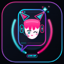

# LALA Chat Overlay

Chat YouTube nempel di atas game — buat yang streaming cuma pakai **satu monitor**.
Nggak ada bubble chat, cuma teks polos di atas layar, selalu di depan, nggak kena alt-tab.

Windows 10/11 + OBS. Author: **LALA**



---

## Ini apa sih

Kalau game-nya fullscreen dan chat-nya ketinggalan di monitor kedua yang nggak punya —
ini solusinya. Chat muncul di jendela transparan yang nempel di atas game.
Klik tembus, jadi nggak ganggu main.

- Baca chat YouTube langsung dari stream yang lagi live
- Jendela transparan, klik tembus (WS_EX_TRANSPARENT), selalu di paling depan
- Ada dock di OBS buat atur-atur
- Jalan **tanpa API key** — nggak perlu daftar Google Cloud apa-apa
- Kalau nggak pakai OBS pun bisa, ada `YouTubeChatOverlay.exe` standalone

---

## Yang butuh disiapin

- Windows 10/11 64-bit
- OBS Studio 28 atau lebih baru (64-bit)
- Stream YouTube yang lagi live + chat-nya nyala

Nggak butuh: Python, Node, Visual Studio, vcpkg, API key YouTube.

---

## Cara pasang (2 langkah)

1. **Ekstrak ZIP** ke folder mana aja (jangan di dalam Program Files)
2. **Klik kanan `PASANG.bat` → Run as administrator**
   (kalau nggak mau admin: klik 2x aja, terus ketik `Y` + Enter)

Installer naruh DLL-nya ke lokasi yang OBS beneran baca:

```
%APPDATA%\obs-studio\plugins\yt-chat-overlay\bin\64bit\yt-chat-overlay.dll
%APPDATA%\obs-studio\plugins\yt-chat-overlay\data\
```

Buka OBS → plugin keload sendiri → cek di **Help → Log Files → View Current Log**,
cari baris:

```
Loaded Modules:
    yt-chat-overlay.dll
```

Kalau ada baris itu, plugin-nya kebaca.

---

## Nyalain dock-nya

1. Buka OBS
2. Menu **Docks** (di menu bar)
3. Centang **LALA Chat Overlay**

Dock-nya muncul. Masukin URL stream / video ID, klik Connect.

---

## Kalau dock-nya nggak muncul

Cek urutan ini:

**1. Cek OBS beneran load plugin-nya**
Help → Log Files → View Current Log → Ctrl+F cari `yt-chat-overlay`.
Ada `Loaded Modules: yt-chat-overlay.dll`? Kalau **nggak ada**, berarti DLL-nya
di lokasi yang salah atau arsitekturnya beda (32 vs 64 bit).

**2. Cek lokasi file**
File harus ada di **tepat** sini:

```
%APPDATA%\obs-studio\plugins\yt-chat-overlay\bin\64bit\yt-chat-overlay.dll
```

Buka File Explorer, ketik `%APPDATA%\obs-studio\plugins` di address bar.
Kalau folder `yt-chat-overlay` nggak ada di situ, installer gagal nyalin —
pasang manual dengan copy-paste, bikin foldernya sendiri.

**3. Pastikan versi OBS 64-bit**
OBS 32-bit nggak bisa baca DLL 64-bit. Cek di Help → About.

**4. Tutup OBS dulu sebelum pasang**
Kalau OBS lagi jalan pas DLL-nya diganti, perubahan baru kebaca setelah
OBS ditutup total (cek Task Manager, pastikan nggak ada `obs64.exe` nyangkut).

---

## `YouTubeChatOverlay.exe` itu apa?

Itu **mesin overlay-nya**, bukan aplikasi yang bisa diklik langsung.

⚠️ **JANGAN klik 2x file ini.** Nggak akan muncul jendela apa-apa.
Prosesnya jalan di Task Manager tapi layarnya kosong — **itu normal, bukan rusak.**

Yang menggerakkannya adalah plugin DLL di dalam OBS. `YouTubeChatOverlay.exe`
dipakai OBS di belakang layar, atau dijalankan dari command line kalau mau
pakai tanpa OBS.

---

## Build dari source

Butuh: CMake 3.20+, Visual Studio 2022 (MSVC), OBS Studio 28+ SDK.

```bat
cmake -S . -B build -G "Visual Studio 17 2022" -A x64
cmake --build build --config Release --parallel
```

Atau pakai GitHub Actions — workflow-nya sudah ada di `.github/workflows/build.yml`,
tiap push ke `main` otomatis build DLL + EXE di `windows-2022`.

**Catatan OBS:** OBS Windows itu MSVC-only. DLL yang di-build pakai mingw
nggak akan keload walau header PE-nya kelihatan benar.

---

## Struktur folder

```
CMakeLists.txt          build script
main.cpp                entry point exe standalone
app.rc                  resource (icon, versi)
youtube/                ngambil chat dari YouTube
overlay/                mesin render + window transparan
obs-plugin/             jembatan ke OBS (dock, controller)
ui/                     dialog setting
installer/              installer (dibungkus jadi .exe)
assets/                 logo, icon
docs/                   catatan riset & arsitektur
```

---

## Lisensi

MIT — lihat [LICENSE](LICENSE).

Silakan pakai, modif, bikin versi sendiri. Kalau mau traktir kopi:
[trakteer.id/nopauwxp](https://trakteer.id/nopauwxp/gift)

---

## Kalau plugin-nya nol kebaca di OBS

Cek dulu: `Menu OBS -> Help -> Log Files -> View Current Log`. Kalau baris
`obs_init_module(yt-chat-overlay.dll)` ada tapi dock nggak muncul, itu beda
masalah -- laporin. Kalau baris itu **nol ada sama sekali**, biasanya salah satu ini:

**1. DLL-nya build Debug.** Ini kejadian di rilis 29 Sep 2026 -- DLL-nya minta
`MSVCP140D.dll` (CRT debug), yang cuma ada di PC yang ada Visual Studio-nya.
Di PC biasa = nol ke-load. **Ini udah diperbaiki**: build wajib Release, dan
CI bakal GAGAL kalau sampai ada CRT debug nyempil.

Kalau mau cek DLL sendiri, jalanin di PowerShell:

```powershell
Select-String -Path .\yt-chat-overlay.dll -Pattern "MSVCP140D.dll" -Encoding Byte -Quiet
# True  = DEBUG, nol bakal jalan di PC biasa
# False = OK
```

**2. DLL-nya salah tempat.** Untuk OBS 28 ke atas, DLL harus di:

```
%APPDATA%\obs-studio\plugins\yt-chat-overlay.dll
```

atau folder OBS-nya:

```
<OBS>\obs-plugins\64bit\yt-chat-overlay.dll
```

Perhatiin: DLL **langsung** di dalam `plugins\` atau `obs-plugins\64bit\`.
Kalau ada `\bin\64bit\` di tengah jalurnya, OBS modern nol baca.

**3. Build ulang sendiri (nol usah Visual Studio):** jalanin `rebuild_release.bat`.
